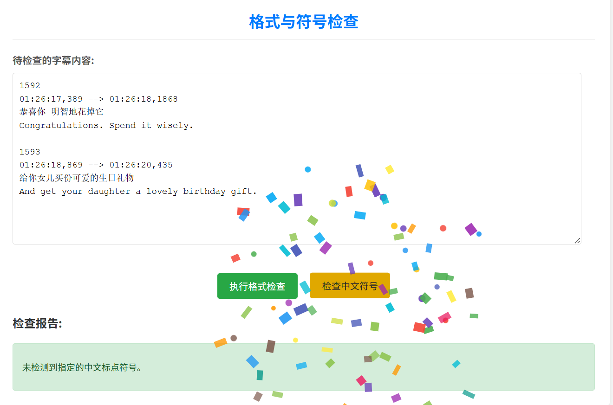

# 字幕工具：合并、格式与符号检查器

## 简介

本项目是一个基于 Python Flask 的 Web 应用，旨在提供一套便捷的字幕处理工具。用户可以直接在网页上处理字幕文本，主要功能包括中英文字幕的合并、中文字幕中括号内容的处理、对合并后字幕的格式校验（包括序号连续性、时间轴逻辑等）以及特定中文标点符号的检查。

当格式或符号检查成功无误时，界面会以“撒花”动画效果给予用户反馈，提升了用户体验。项目采用 AJAX 技术进行检查操作，避免了页面整体刷新。

## 主要功能

* **字幕合并**：
    * 支持输入英文字幕和对应的中文字幕内容。
    * 根据字幕序号进行匹配合并。
    * 合并后的格式为：中文翻译在上，英文原文在下。
* **中文括号内容自动移除**：
    * 在合并前，自动删除中文字幕输入中的半角 `()` 或全角 `（）` 括号及其内部的内容。
* **格式检查 (AJAX)**：
    * 用户可以粘贴已合并的字幕内容进行检查。
    * **结构检查**：验证每段字幕是否大致符合“序号 -> 时间轴 -> 中文文本 -> 英文文本”的结构。
    * **序号检查**：检查序号是否从第一个出现的序号开始连续且递增。
    * **时间轴格式检查**：确保时间轴符合 `HH:MM:SS,mmm --> HH:MM:SS,mmm` 格式（毫秒部分会做严格的3位检查）。
    * **时间轴逻辑检查**：
        * 单个时间轴内：开始时间 ≤ 结束时间。
        * 时间轴之间：后一个字幕条目的开始时间 ≥ 前一个字幕条目的结束时间。
    * 检查成功时会有撒花庆祝效果。
* **中文符号检查 (AJAX)**：
    * 用户可以粘贴字幕内容进行检查。
    * 检测是否存在指定的中文输入法符号：`；` `，` `。` `！` `“` `”` `（` `）`。
    * 书名号 `《 》` 和间隔号 `·` 不在检查范围内。
    * 列出包含这些指定中文符号的字幕段落。
    * 检查无指定符号时会有撒花庆祝效果。
* **用户体验**：
    * 格式与符号检查通过 AJAX 实现，无需刷新页面即可获取结果。
    * 清晰的错误和成功消息提示。

## 技术栈

* **后端**：Python, Flask
* **前端**：HTML, CSS, JavaScript
* **核心库**：`re` (正则表达式，Python内置)

## 截图预览 




## 本地运行与设置

### 环境要求

* Python 3.x
* pip (Python包管理工具)

### 安装步骤

1.  **克隆仓库**:
    ```bash
    git clone https://github.com/1525164075/Leetcode-150.git
    cd subtitle_merger
    ```

2.  **创建并激活虚拟环境** (推荐):
    
    * Windows:
        ```bash
        python -m venv venv
        .\venv\Scripts\activate
        ```
    * macOS/Linux:
        ```bash
        python3 -m venv venv
        source venv/bin/activate
        ```
    
3.  **安装依赖**:
    项目根目录下应包含一个 `requirements.txt` 文件。如果还没有，您可以手动创建一个，至少包含 Flask。建议您在自己的虚拟环境中通过运行以下命令生成：
    ```bash
    pip freeze > requirements.txt
    ```
    然后安装：
    ```bash
    pip install -r requirements.txt
    ```
    如果 `requirements.txt` 初始为空，至少需要安装 Flask:
    ```bash
    pip install Flask
    ```

### 运行应用

1.  确保您在项目的根目录下（即包含 `app.py` 文件的目录）。
2.  运行以下命令启动 Flask 开发服务器：
    ```bash
    python app.py
    ```
    或者，如果您的 Python 3 可执行文件名为 `python3`:
    ```bash
    python3 app.py
    ```
3.  应用启动后，通常会在控制台显示类似信息：
    `* Running on http://127.0.0.1:5000/ (Press CTRL+C to quit)`
4.  在您的网页浏览器中打开 `http://127.0.0.1:5000/` 即可访问该工具。

## 使用说明

1.  **合并字幕**：
    * 在“英文字幕内容”文本框中粘贴原始英文字幕。
    * 在“中文翻译内容”文本框中粘贴对应的中文翻译。
    * 点击“合并字幕”按钮。合并后的内容（若成功）或错误信息会显示在下方。
2.  **格式与符号检查**：
    * 在“待检查的字幕内容”文本框中粘贴您想要检查的字幕文本（通常是已合并或待校验的字幕）。
    * 点击“执行格式检查 (AJAX)”按钮：程序会进行序号、时间轴、结构的检查。结果会动态显示在下方，页面不刷新。若无误，会有撒花效果。
    * 点击“检查中文符号 (AJAX)”按钮：程序会检查是否存在指定的中文标点。结果会动态显示，若无指定符号，会有撒花效果。

## 项目结构

```text
subtitle_merger/
├── app.py             # Flask 后端主应用逻辑
├── templates/
│   └── index.html     # 前端HTML模板
└── requirements.txt   # Python 依赖列表 (需要创建这个文件)
└── README.md          # 项目说明文件 
```

